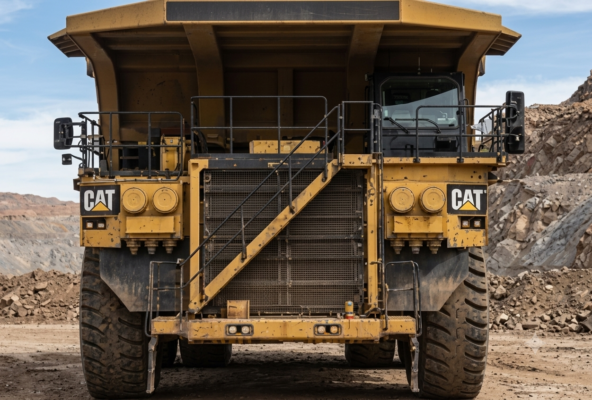
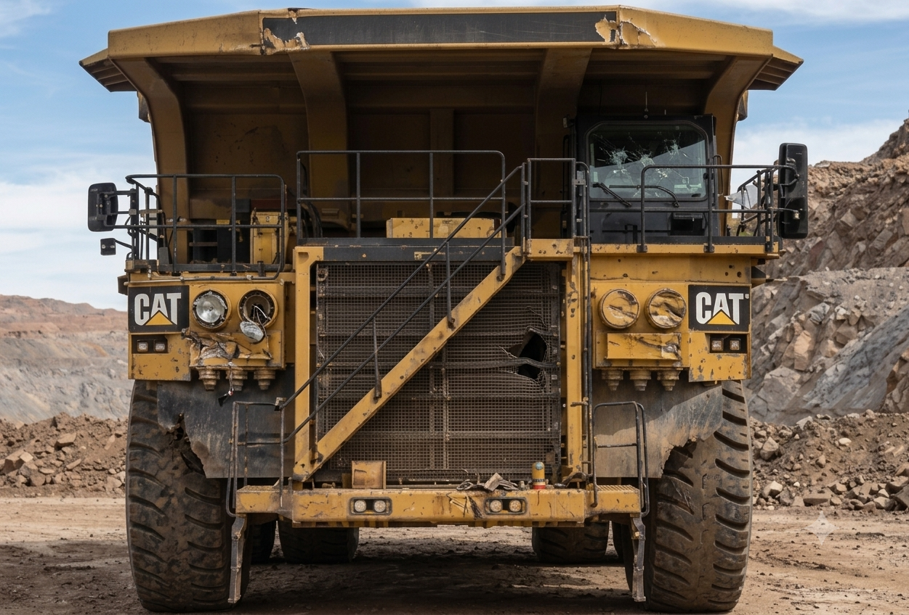
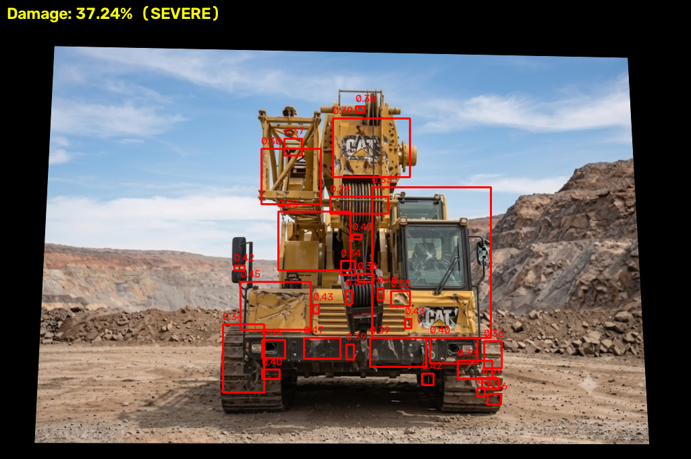
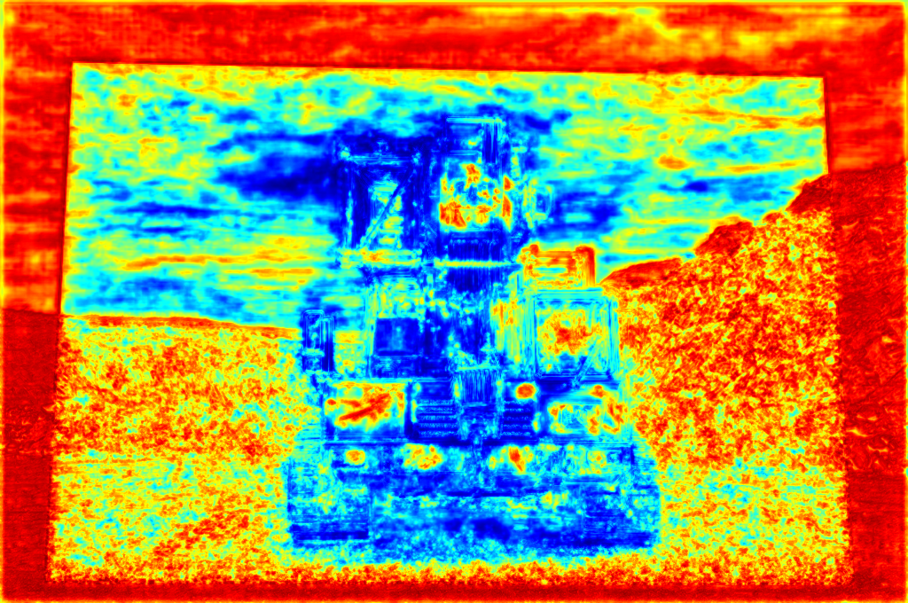

# Smart Rental Tracking System — Caterpillar Fleet Suite

A collection of standalone Python tools for managing a rental fleet of heavy
construction and mining equipment (Caterpillar machines) across sites in Chennai
and Bengaluru. The suite simulates live telemetry, tracks machines on a
geofenced map, detects check-in/check-out damage with computer vision, scores
vehicle health, predicts equipment demand, and brokers equipment sharing between
sites.

Each module runs independently from the command line — there is no single app to
launch; you pick the tool for the job.

---

## Highlights

- **Live telemetry simulation** — generates realistic, continuously updating
  equipment sensor data (GPS, engine hours, temperature, fuel, battery).
- **Geofenced live map** — a Flask + Leaflet map showing every machine inside its
  site boundary, with breach detection when a unit leaves its assigned plot.
- **CV damage detection** — compares before/after photos of a machine and
  highlights new damage, with a percentage severity score.
- **Vehicle health & upgrade advisor** — flags over-worked machines and
  recommends servicing or replacement using trend analysis.
- **Demand predictor** — scrapes project and weather signals to forecast which
  equipment each site will need.
- **Equipment-sharing broker** — reallocates idle machines to nearby busy sites.
- **QR / check-in workflow** and **SMS alerting** via Twilio.

---

## Computer-vision damage detection

On check-out, the machine is photographed from multiple views and compared
against its check-in baseline. The pipeline segments the vehicle (rembg /
DeepLabV3), aligns the two images (ORB feature matching + homography), computes a
perceptual difference map (VGG16 features), and boxes the changed regions —
producing an annotated image and a heatmap, plus a damage percentage.

**Before → After (check-in baseline vs damaged check-out)**

<table>
  <tr>
    <td align="center"><b>Before (check-in)</b></td>
    <td align="center"><b>After (check-out)</b></td>
  </tr>
  <tr>
    <td></td>
    <td></td>
  </tr>
</table>

**Detection output**

<table>
  <tr>
    <td align="center"><b>Annotated damage regions</b></td>
    <td align="center"><b>Perceptual difference heatmap</b></td>
  </tr>
  <tr>
    <td></td>
    <td></td>
  </tr>
</table>

Damage is scored and banded as **MINIMAL / MINOR / MODERATE / SEVERE**; the
example above reports **37.24% — SEVERE**.

---

## Modules

| File | What it does |
|------|--------------|
| `data_synth.py` | Simulates live fleet telemetry (3 shifts/day) and streams rows in the shared column format. Feeds the map and other tools. |
| `map.py` | Flask server rendering a Leaflet map; draws each site's fixed 4-corner boundary, plots live machines, and flags boundary breaches. |
| `img_seg.py` | Before/after computer-vision damage detection. Outputs `annotated_after.png` and `heatmap.png` with a damage %. |
| `vehicle_health_fuzzy.py` | Health scoring + upgrade advisor from telemetry trends (fuel-rate rise, engine temperature, engine hours); also rolls up per-site scores. |
| `predictor.py` | Scrapes project/plan and weather signals and predicts equipment demand per site (construction vs mining). |
| `equipment_sharing.py` | Broker that finds under-utilised machines (downtime > 6h) and offers them to nearby sites within the same metro. |
| `qr.py` | Camera-based QR / object check-in workflow that updates the machine↔object mapping in `op.csv`. |
| `test.py` | Standalone Twilio SMS test (reads credentials from environment variables). |

### Data & assets

| Path | Contents |
|------|----------|
| `rental_db/` | Master fleet CSV, telemetry, listings, per-site text files. |
| `sites/` | Per-site inventory text files (`site_S001.txt` … `site_S006.txt`). |
| `scraped/` | Cached `plans.txt` and `weather.txt` used by the predictor. |
| `output/` | Predictor results (`demand_vehicles.json` / `.txt`) and memory. |
| `truck/`, `crane/` | Multi-view before/after photo sets used by the CV pipeline. |
| `data_sources.csv`, `fleet_db.json`, `shares.json`, `op.csv` | Supporting data. |

---

## Sites

Six real sites across two metros (plus a `NULL` yard for unassigned units):

| Site | Location | Type |
|------|----------|------|
| S001 | Ambattur, Chennai | Construction |
| S002 | Tambaram, Chennai | Construction |
| S003 | Whitefield, Bengaluru | Construction |
| S004 | Electronic City, Bengaluru | Mining |
| S005 | Yelahanka, Bengaluru | Mining |
| S006 | Sholinganallur (OMR), Chennai | Mining |

---

## Getting started

### Prerequisites

- **Python 3.10+**
- A **webcam** for `qr.py`
- A **GPU** is optional but speeds up `img_seg.py` (CPU works too)

### Install

```bash
git clone https://github.com/<your-username>/<repo>.git
cd <repo>
python -m venv .venv
source .venv/bin/activate        # Windows: .venv\Scripts\activate
pip install -r requirements.txt
```

> The first run of `img_seg.py` downloads pretrained DeepLabV3 / VGG16 weights.

---

## Usage

**Live telemetry + map**
```bash
# Terminal 1 — start the geofenced live map (spawns the simulator itself)
python map.py
# then open the local URL it prints
```

**Damage detection**
```bash
python img_seg.py <before_image> <after_image> [threshold]
# example:
python img_seg.py truck/front/before.png truck/front/after.png 0.35
# writes annotated_after.png and heatmap.png
```

**Vehicle health / upgrade advisor**
```bash
python vehicle_health_fuzzy.py            # fleet report + site scoreboard
python vehicle_health_fuzzy.py --sites    # site scoreboard only
python vehicle_health_fuzzy.py --only 320-U01   # one machine, day by day
```

**Demand prediction**
```bash
python predictor.py       # writes output/demand_vehicles.json
```

**Equipment sharing broker**
```bash
python equipment_sharing.py init      # seed a demo DB
python equipment_sharing.py report
python equipment_sharing.py run
```

**QR check-in**
```bash
python qr.py              # reads op.csv, opens the camera
```

---

## SMS alerts (optional)

`test.py` and the map's breach alerts use Twilio. Provide credentials as
environment variables (never commit them):

```bash
export TWILIO_ACCOUNT_SID=...
export TWILIO_AUTH_TOKEN=...
export TWILIO_FROM=+1...
export TWILIO_TO=+91...
python test.py
```

---

## Notes / TODO

- [ ] The suite is a set of independent scripts, not one integrated app; a thin
      launcher or dashboard could tie them together.
- [ ] Several scripts assume they are run from the repo root (relative paths like
      `rental_db/`, `op.csv`). Run them from the project root.
- [ ] Twilio credentials and any API keys must stay in environment variables /
      `.env` (already git-ignored) — do not commit them.
- [ ] The file `Smart rental sharing #U00b7.py` was renamed to
      `equipment_sharing.py` (spaces and `#` in a filename break git URLs and
      shell usage). Update any references you have to the old name.

---

## License

No license file is included yet. Add one (e.g. MIT) if you want others to reuse
this project.
